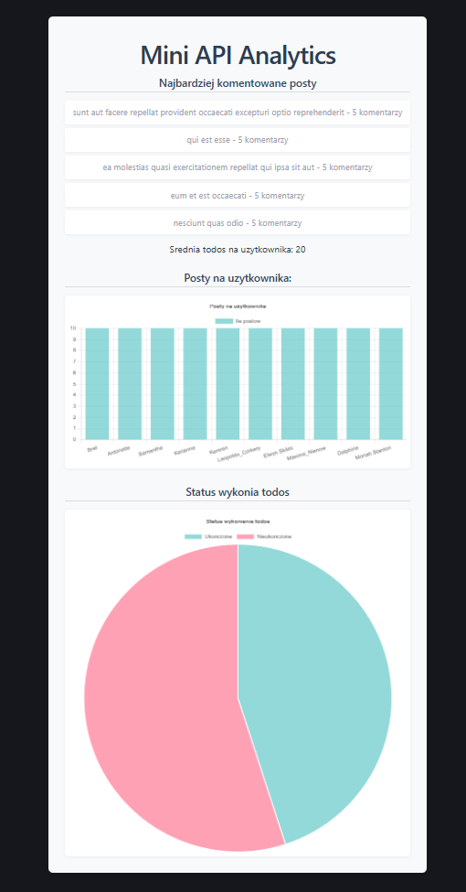

# Mini API Analytics

## Opis projektu

Aplikacja webowa stworzona w React, która pobiera dane z publicznego API:
[JSONPlaceholder API](https://jsonplaceholder.typicode.com)

Na podstawie tych danych obliczane są proste statystyki dotyczące aktywności użytkowników, a następnie wizualizowane za pomocą wykresów.

Projekt został zbudowany przy użyciu Vite i wykorzystuje bibliotekę Chart.js do tworzenia wykresów.

## Technologie

- React
- Vite
- JavaScript
- Chart.js
- GitHub Pages (deploy)

## Metryki

Aplikacja oblicza następujące statystyki:

- liczba postów na użytkownika
- procent wykonanych i niewykonanych TODO
- top 5 najbardziej komentowanych postów
- średnia liczba TODO na użytkownika

## Wizualizacje

W aplikacji wykorzystano dwa typy wykresów:

- wykres słupkowy – liczba postów na użytkownika
- wykres kołowy – procent wykonanych i niewykonanych TODO

## Zrzut ekranu



## Uruchomienie projektu

Instalacja zależności:
```bash
npm install
```

Uruchomienie projektu lokalnie:
```bash
npm run dev
```

Build produkcyjny:
```bash
npm run build
```

## Demo

Aplikacja jest dostępna pod adresem:

https://polmiss.github.io/mini-api-analytics/

## Użycie AI

Podczas tworzenia projektu korzystałem z ChatGPT jako narzędzia wspomagającego. AI pomogło między innymi w:

- wyjaśnieniu działania React (useState, useEffect),
- zaproponowaniu struktury projektu React,
- analizie i poprawie napisanego przeze mnie kodu (szczególnie w pliku analytics.js),
- generowaniu przykładowego kodu do wykresów z użyciem Chart.js,
- wygenerowaniu struktury JSX w komponencie App.jsx,
- poprawieniu kodu odpowiedzialnego za pobieranie danych z API,
- pomocy przy wdrożeniu aplikacji na GitHub Pages,
- sprawdzeniu czy projekt spełnia wymagania zadania,
- uporządkowaniu moich pomysłów i wygenerowaniu spójnego pliku README na ich podstawie.